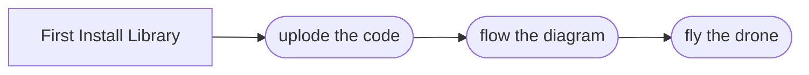

# Tello_esp8266
Control Tello Drone, by microcontroller made by **Karan Singh**

# Steps
### First #1
Please download Tello library created by me
>here's the link : https://github.com/DEAD-GOST/Tello
### Second #2
* In **Code** file, u will find code, upload it to esp8266 or any esp
*  make sure to use my library
*  And change wifi SSID to your SSID
*  And change the pasword
### Third #3
* Create a circuit using this **Diagram**

## circuit diagram

##  Flow Chart

And this will produce a flow chart:

> FlyDrone like Sova in valorant game :)
